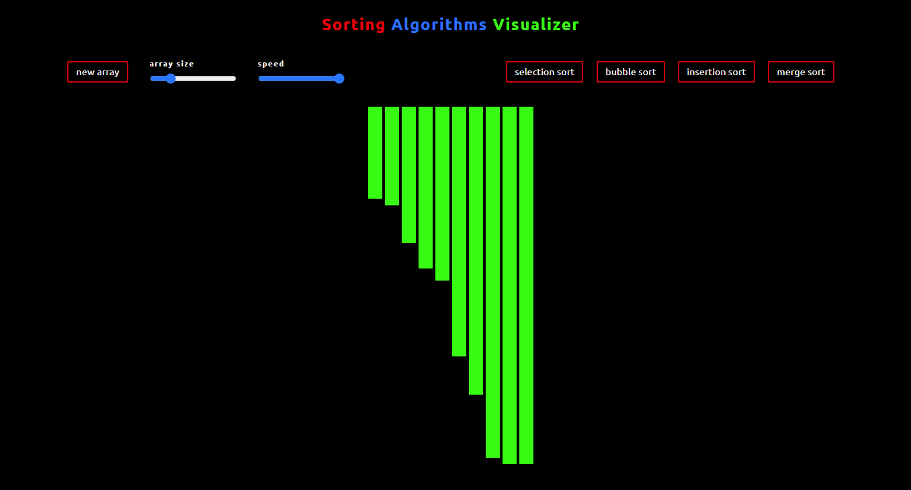

# Sorting Visualizer
## Javascript Project

Project was made to test skills in Javascript, HTML, and CSS

Gives a visualizer to the sorting algorithms: 
- Selection sort
- Bubble sort
- Insertion sort
- Merge sort

## Features
1. Buttons to choose between which algorithms you want to see
2. Sliders to choose the array size and speed (can be changed on demand as well) of the bars being sorted
3. Button for generating a new array after choosing an array size
4. Also has media rules for the web app if ever hosted somewhere and viewed on a mobile device

Might add a timer to shows how long each algorithm takes, number to display next to array size and speed, change CSS for more practice, maybe more algorithms to choose as well

## Installation
No installation. Clone repo and open index.html in a browser of your choice.

## Help
Help with design and some implementation from:

https://www.geeksforgeeks.org/selection-sort-visualizer-in-javascript/

https://dev.to/x_walker_x/my-sorting-visualizer-project-journey-with-crio-do-mk8